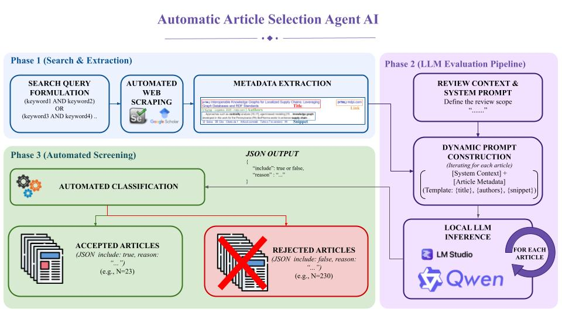

# 📚 Google Scholar Article Selection Pipeline

> A semi-automated pipeline to collect, filter, and curate academic papers for structured literature reviews — powered by browser automation and LLM-based reasoning.


---

## How It Works


*Fig. 1 — Full pipeline: from search query to curated literature*

```
  Google Scholar          Raw Data              LLM Agent           Curated Output
  ┌────────────┐        ┌──────────┐          ┌──────────┐         ┌─────────────┐
  │  Selenium  │──────▶ │  data/   │─────────▶│ LMStudio │───────▶│  output/    │
  │  Scraper   │        │ .xlsx    │          │  Qwen3   │         │   .xlsx     │
  └────────────┘        └──────────┘          └──────────┘         └─────────────┘
   find_papers.py                              paper_selection.py
```

---

## Project Structure

```
.
├── main.py               # Entry point — runs the full pipeline
├── find_papers.py        # scrape_scholar() — Selenium scraper for Google Scholar
├── paper_selection.py    # select_papers()  — LLM-based article classification
├── webscraping.py        # open_tab()       — Chrome driver setup
├── llm_models.py         # auto_select_llm_model() — LMStudio model loader
├── data/
│   └── articles.xlsx     # Raw scraped article data (generated by scrape_scholar)
├── output/
│   └── selected_articles.xlsx  # Final curated results with LLM annotations
└── requirements.txt
```

---

## Module Overview

### `webscraping.py` — Chrome Driver

Launches a Chrome instance configured to bypass bot-detection via `undetected_chromedriver`.

```python
from webscraping import open_tab

driver, options = open_tab()
```

### `llm_models.py` — Model Loader

Queries LMStudio for loaded models and returns the first available one. Raises a `RuntimeError` if no model is loaded.

```python
from llm_models import auto_select_llm_model

model = auto_select_llm_model()
```

### `find_papers.py` — Scraper

Automates Google Scholar searches and exports raw article data to Excel.

```python
from find_papers import scrape_scholar

scrape_scholar(query="...", output_filename="papers.xlsx")
```

- Collects **titles, authors, snippets, and links** for each result
- Navigates through pages with support for **manual CAPTCHA handling**
- Exports all raw data to `data/<output_filename>`

### `paper_selection.py` — LLM Agent

Reads scraped data, classifies each article via LMStudio, and exports results.

```python
from paper_selection import select_papers

select_papers(
    input_filename="papers.xlsx",
    output_filename="results.xlsx",
    prompt_template="..."   # must contain {title}, {authors}, {snippet}
)
```

- Evaluates each paper against a user-provided **taxonomy prompt**
- Creates a **fresh chat session per paper** to avoid hallucination carry-over
- Requests a structured JSON response:

```json
{
  "include": true,
  "category": "Structural Analysis & Centrality Measures",
  "reason": "Directly addresses betweenness centrality in supply chain graphs..."
}
```

- Saves curated results to `output/<output_filename>`

---

## Usage

To run the full pipeline, simply execute:

```bash
python main.py
```

`main.py` is the single entry point. Edit the `query`, `prompt_template`, and file name constants at the top of the file to customise the run — no other files need to be modified.

---

## Prerequisites

| Requirement | Version |
|---|---|
| Python | 3.10+ |
| Google Chrome | Latest |
| LMStudio | Latest |

### Install Dependencies

```bash
pip install -r requirements.txt
```

---

## Notes

> **⚠️ CAPTCHA Handling:** Google Scholar may throttle automated requests. When prompted, navigate result pages manually in the browser window — the script pauses and resumes automatically once you proceed.

> **🤖 LLM Model:** The script auto-selects the first model loaded in LMStudio. You can switch models directly in LMStudio without modifying any code — just load a different model and restart the local server.

> **🔧 ChromeDriver Version Mismatch:** If you get a `SessionNotCreatedException` about ChromeDriver and Chrome versions being incompatible, delete the cached driver. On Windows, open File Explorer and delete the folder at:
> ```
> %APPDATA%\undetected_chromedriver
> ```
> On Mac/Linux:
> ```bash
> rm -rf ~/.local/share/undetected_chromedriver
> ```
> Then re-run the script — `undetected_chromedriver` will download the correct version automatically.

> **📁 Data Organization:** Keeping raw data in `data/` and results in `output/` ensures reproducibility and allows you to re-run the classification step independently without re-scraping.

---

## Example Workflow

1. Open `main.py` and set your **search query** and **prompt template**
2. Make sure a model is loaded and running in **LMStudio**
3. Run `python main.py` — the browser will open automatically
4. **Solve any CAPTCHAs** manually in the browser when prompted
5. Review the final output in `output/selected_articles.xlsx`

---

## Output Columns

| Column | Description |
|---|---|
| `Title` | Paper title |
| `Include` | `true` / `false` — whether to include the paper |
| `Category` | Taxonomy category assigned by the LLM |
| `Reason` | Concise justification for the classification decision |

---

## Tech Stack

| Tool | Purpose |
|---|---|
|  | Core scripting language |
|  | Browser automation & scraping |
|  | Undetected Chrome driver |
|  | Local LLM inference server |
|  | Data storage and export |

---

*This setup provides a semi-automated pipeline to collect, evaluate, and select academic papers for structured literature reviews — combining Selenium-based web scraping with LLM-powered classification.*
